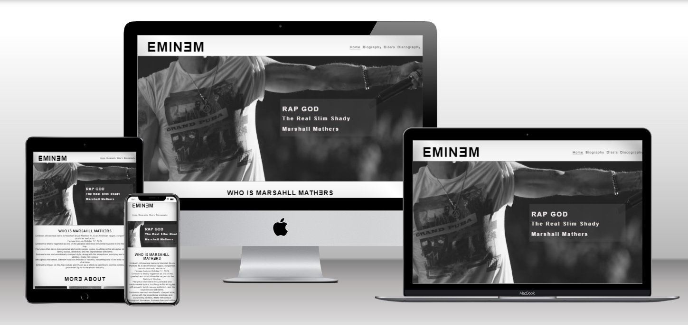
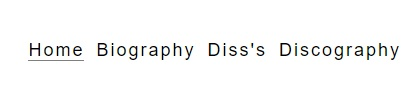
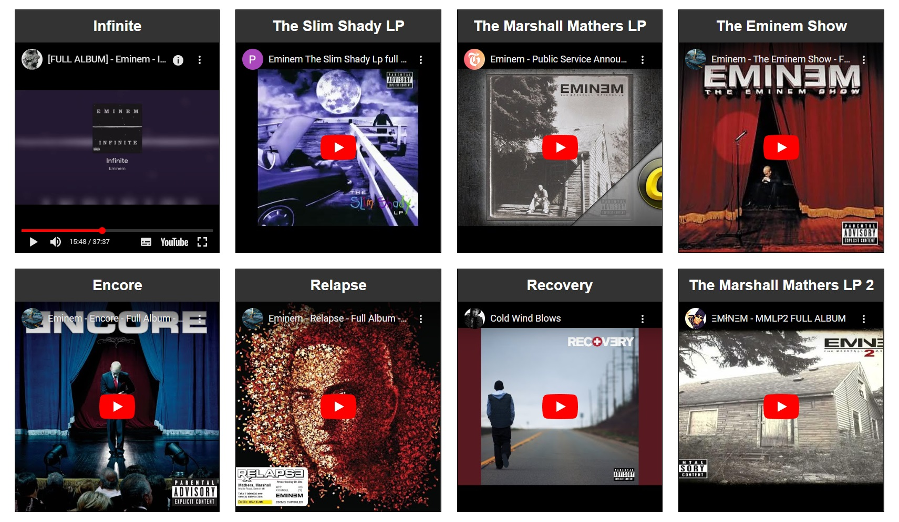
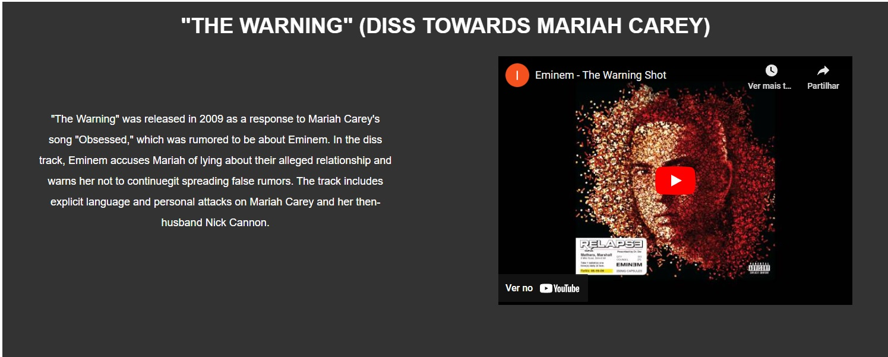
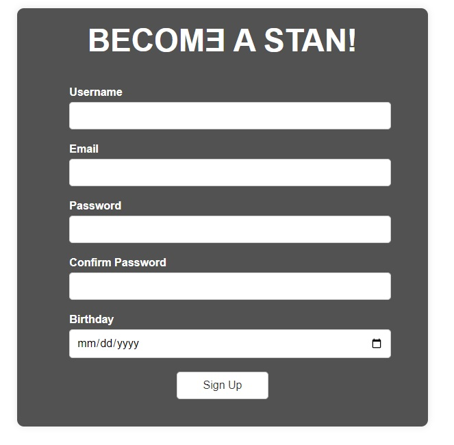
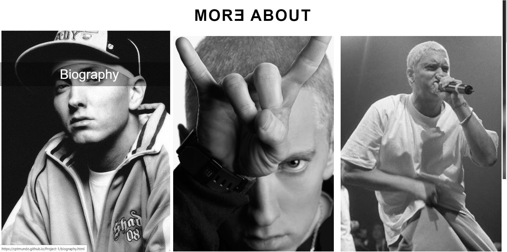
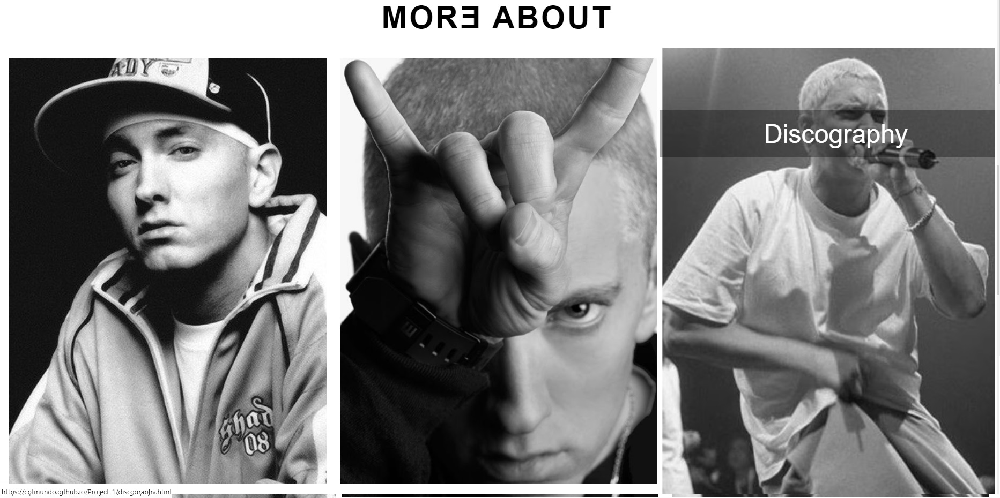
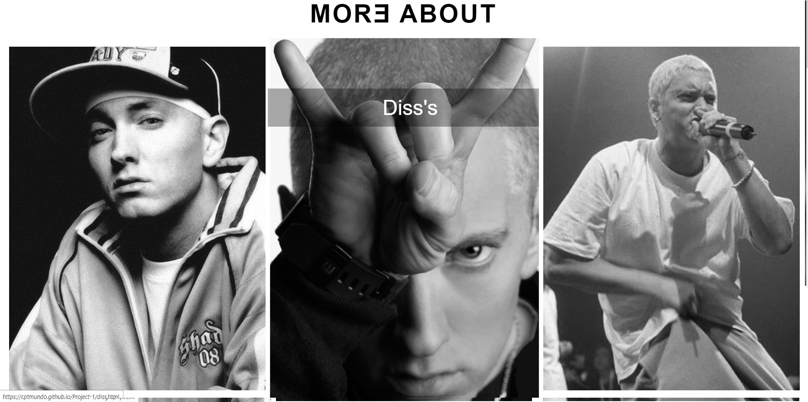
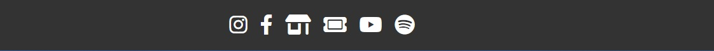
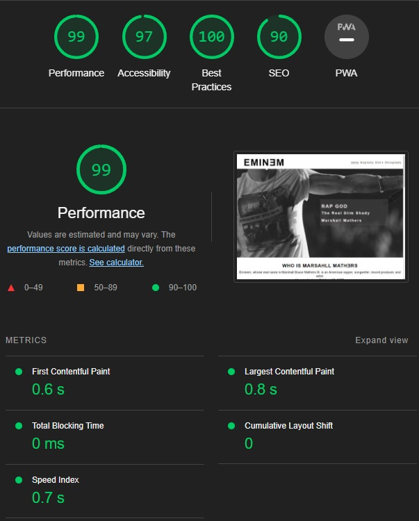

# EminƎm Website

## Description

The EminƎm website is dedicated to the legendary American rapper, Eminem (Marshall Bruce Mathers III). It provides users with various sections to explore, including a biography page, a discography page, and a page dedicated to his diss tracks. Additionally, visitors can sign up to stay updated on the latest news related to Eminem.

## Pages

- **Home:** The landing page featuring a captivating header image with a zoom animation on page load and a short introduction to Eminem's life and career.- 
- **Biography:** This page provides an in-depth look at Eminem's life, his struggles, and his immense impact on hip-hop culture.
- **Discography:** Explore Eminem's extensive discography, including his albums, singles, and collaborations. The Discography page features embedded videos from YouTube for all full albums.
- **Diss's:** Discover Eminem's legendary diss tracks and the stories behind some of his most iconic feuds.
- **Sign Up:** A sign-up form where users can become "Stans" and receive updates on Eminem's latest news and events.
- **Thank You:** A page to express gratitude to users who signed up, acknowledging their support for Eminem. The Thank You page includes a button linking back to the Homepage.

## Installation

To run this website locally, follow these steps:

1. Clone the repository to your local machine.
2. If you prefer using Codeanywhere, create a new project in Codeanywhere and set up a new container.
3. Copy the repository files to your Codeanywhere container.
4. Open the `index.html` file in the container's web preview or through a web browser.

## Features

- A responsive and visually appealing design with hover animations.
- Navigation menu with a highlight feature to indicate the current page.
  
- Information-rich biography section providing insights into Eminem's life and career.
- Discography page showcasing Eminem's extensive musical journey, with embedded videos from YouTube for all full albums.
  
- A dedicated page for Eminem's iconic diss tracks and feuds.
  
- Sign-up form for users to receive updates and news about Eminem.
  
- Homepage with three linked images with hover animations:
  1. **Biography Image:** Links to the Biography page.
   
  2. **Discography Image:** Links to the Discography page.
   
  3. **Diss's Image:** Links to the Diss's page.
   
- The EminƎm logo in the header is linked to the Home page.
  
- Footer with icons linked to social media profiles with hover animations:
  - Instagram
  - Facebook
  - YouTube
  - Spotify
- Additional icons in the footer linked to:
  - Official Merchandise Shop
  - Ticket Shop for Eminem's concerts

## Testing

Testing is an important part of the development process to ensure that the website functions correctly and provides a seamless user experience. During development, various testing methods should be employed, including:

- **Responsiveness Testing:** Test the website on various devices and screen sizes to ensure it adapts well to different resolutions.

- **Functional Testing:** Check all interactive elements like buttons, forms, and navigation links to ensure they work as expected.
- 
- **Video Embed Testing:** Ensure that the embedded YouTube videos on the Discography page play properly and do not cause any issues.
- 
- **Sign-Up Form Testing:** Verify that the Sign-Up form captures user data accurately.

- **Lighthouse index.html**
- 
   

- **Lightouse biography.html**
- 
  

- **Lighthouse discography.html**
- 
  

- **Lighthouse diss.html**
- 
  

- **Lighthouse singup.html**
- 
  
  
## Technologies Used

- HTML
- CSS
- Font Awesome Icons (<https://fontawesome.com/>)

## Contributing

We welcome contributions to improve this website. If you have suggestions, find issues, or want to add features, feel free to create a pull request.

## Contact

For any questions or feedback, please contact the project maintainers:

- Email: [victor.emmanuel.silva97@gmail.com](victor.emmanuel.silva97@gmail.com)

## Acknowledgments

Special thanks to my mentor that guided trought the project and gave me some tips and to W3Schools for their tutorials.
